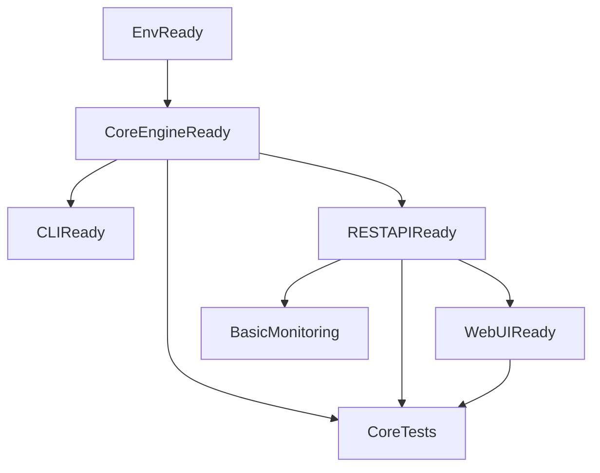

## 目标

- **核心目标**: 基于现有的 vLLM + Qwen2.5-3B-Instruct 部署，封装出一个“小而全”的 Mini vLLM：
  - 支持 **流式对话** 的 REST API
  - 提供 **命令行/脚本调用** 方式
  - 提供一个简单的 **Web 对话界面**（浏览器即可访问）
  - 项目结构清晰，便于后续扩展批量推理、Profiling 等能力

---

## 阶段 0：环境与基础结构确认

- **任务 0.1 环境确认**
  - 确认当前 WSL2 + Ubuntu 22.04 下已有的 vLLM 环境（Python 版本、vllm 版本、显卡/驱动是否正常工作）。
  - 如果已有 Qwen2.5-3B-Instruct 的启动脚本或命令，将其记录为项目 README 的“参考命令”。

- **任务 0.2 项目结构初始化**
  - 在工作目录下创建一个独立项目（例如 `mini-vllm-qwen/`）。
  - 规划基础目录结构：
    - `mini-vllm-qwen/`
      - `src/`
        - `core/`：封装与 vLLM/Qwen 模型交互的核心逻辑
        - `api/`：REST API 层（例如 FastAPI/Fastify 等）
        - `cli/`：命令行入口
        - `web/`：Web UI（前后端一体或仅前端静态页面）
      - `tests/`：后续单元测试位置
      - `requirements.txt` 或 `pyproject.toml`：Python 依赖
      - `README.md`：使用说明与开发说明

- **任务 0.3 依赖与运行方式约定**
  - 选定后端框架：**FastAPI + Uvicorn**（易于实现流式响应，生态成熟）。
  - 日志库使用 Python 标准库 `logging` 或 `loguru`（可选），先保证简单易用。
  - 约定项目主要通过 `python -m` 或 `uvicorn` 方式运行 API 服务，通过 `python -m src.cli.chat` 提供 CLI 对话入口。

---

## 阶段 1：核心推理封装（Core Layer）

- **任务 1.1 模型加载与配置抽象**
  - 在 `src/core/model.py`（示例文件名）中封装：
    - 模型加载逻辑：从环境变量或配置文件读取模型名称、设备、并发参数。
    - 统一的 `MiniVLLMEngine` / `QwenEngine` 类，隐藏底层 vLLM 的细节。
  - 关键接口示例：
    - `generate(prompt: str, ..., stream: bool = False) -> Union[str, Iterable[str]]`
    - 支持传入基础生成参数（max_tokens、temperature、top_p 等）。

- **任务 1.2 简单对话状态管理（最小实现）**
  - 在 `src/core/conversation.py` 中提供轻量的会话结构：
    - `Conversation` / `ChatSession` 对象，维护最近 N 轮对话历史。
    - 提供 `append_user`, `append_assistant`, `build_prompt()` 等方法。
  - 首版可以只支持单轮或简易多轮（例如只保留最近几轮），重点确保接口清晰。

- **任务 1.3 配置与日志**
  - 在 `src/core/config.py` 中定义基础配置结构：
    - 模型名称、最大并发、默认生成参数等，可从 `.env` 或环境变量中读取。
  - 在 `src/core/logging.py` 中封装日志初始化：
    - 统一日志格式（时间 + 级别 + 模块 + 消息）。

---

## 阶段 2：CLI 对话入口

- **任务 2.1 简单 CLI 程序**
  - 在 `src/cli/chat.py` 中实现：
    - 命令行不断读取用户输入（支持多轮）并调用 `MiniVLLMEngine`。
    - 支持参数选择是否 `--stream` 流式打印 Token。
  - 使用 `argparse` 或 `typer` 作为 CLI 框架。

- **任务 2.2 CLI 使用体验优化**
  - 控制台友好打印：用户输入前缀 `User:`, 模型输出 `Assistant:`。
  - 提供退出指令（例如输入 `exit` / `quit`）。
  - 增加基础参数：`--temperature`, `--max-tokens` 等。

---

## 阶段 3：REST API（重点：流式对话）

- **任务 3.1 基础 REST 服务框架**
  - 在 `src/api/server.py` 中使用 FastAPI 搭建：
    - 健康检查接口：`GET /health`。
    - 非流式对话接口：`POST /v1/chat/completions`（兼容 OpenAI 风格请求体）。
  - 启动命令示例（写入 README）：
    - `uvicorn src.api.server:app --host 0.0.0.0 --port 8000`。

- **任务 3.2 流式输出接口**
  - 在同一文件中增加：
    - `POST /v1/chat/completions` 支持 `stream=True`，使用 FastAPI 的 `StreamingResponse`。
  - 将 `MiniVLLMEngine.generate(..., stream=True)` 的迭代结果映射为类似 OpenAI 的 `data: ...\n\n` SSE 或分块 JSON 流式响应。

- **任务 3.3 简单错误处理与限流**
  - 为关键接口增加基础异常处理：
    - 模型未初始化、GPU 无法访问、参数错误等情况返回合适的 HTTP 状态码与错误信息。
  - （可选）增加简单的全局依赖或中间件进行 QPS 限制或每请求最大 Tokens 限制。

- **任务 3.4 API 文档与示例**
  - 利用 FastAPI 自动生成 Swagger 文档（`/docs`）。
  - 在 README 中添加：
    - 使用 `curl` / Python `requests` 调用非流式和流式接口的示例。

---

## 阶段 4：Web 对话界面

- **任务 4.1 选型与结构**
  - 选用一个简单方案：
    - 直接在 FastAPI 中挂载一个静态前端页面（例如 `src/web/static/index.html`），使用原生 JS 或轻量框架（如 Vue/React CDN 版）。
  - 页面目标：
    - 左侧/顶部输入框 + 发送按钮。
    - 中间展示对话历史（User/Assistant 气泡）。

- **任务 4.2 调用 REST API（含流式）**
  - 前端通过 `fetch` / EventSource / ReadableStream 调用 `POST /v1/chat/completions` 的流式接口：
    - 实现“正在生成…”的实时追加文本效果。
  - 先支持一个会话窗口，后续可再扩展多会话或会话 ID。

- **任务 4.3 UI 体验优化（最小但现代）**
  - 添加简单的 CSS：
    - 响应式布局（兼容桌面/平板）。
    - 区分用户和模型的气泡颜色。
    - 滚动到最新消息。

---

## 阶段 5：配置、监控与扩展点预留

- **任务 5.1 配置集中化**
  - 将 CLI、API、Web 所依赖的模型配置、默认推理参数统一到 `config`。
  - 使用 `.env` 文件（可选）配置：端口、并发数、显存策略等。

- **任务 5.2 基础监控与日志增强（轻量）**
  - 为生成调用记录：
    - 每次请求记录 prompt 长度、生成 token 数、耗时。
  - 暴露一个简单状态接口：
    - 例如 `GET /metrics/basic` 返回 JSON，包括最近 N 分钟请求数、平均延迟等（不必复杂到 Prometheus）。

- **任务 5.3 为后续功能预留接口**
  - 在核心层设计中预留：
    - 批量推理接口 `generate_batch(prompts: List[str], ...)` 的空实现或 TODO。
    - 插件机制占位：例如 `hook_preprocess`, `hook_postprocess` 函数列表，将来可注入自定义逻辑。

---

## 阶段 6：文档与简单测试

- **任务 6.1 README 编写**
  - 内容包括：
    - 环境要求（GPU/驱动、Python 版本、vLLM 版本）。
    - 安装依赖、启动 CLI、启动 REST API、访问 Web UI 的步骤。
    - 示例请求与示例响应（含流式用法说明）。

- **任务 6.2 最小测试用例**
  - 在 `tests/` 中添加：
    - 对 `MiniVLLMEngine` 的 Mock 测试（不实际加载大模型，只测试接口逻辑）。
    - 对 REST API 使用 FastAPI `TestClient` 进行 1–2 个基础用例（健康检查、简单对话）。

---

## 简要任务依赖关系（Mermaid）

- **说明**：
  - 先把核心推理封装好（`CoreEngineReady`），再铺 CLI、API、Web 三条“接入层”。
  - 监控与测试最后补充，确保 Mini vLLM 在功能可用后有基本的可靠性和可观测性。

## agent提供的执行顺序
1. 0.3 → 写 requirements.txt 和运行约定（README 里记一笔）。
2. 1.3 → config.py + logging.py。
3. 1.1 → model.py（MiniVLLMEngine）。
4. 1.2 → conversation.py。
5. 2.1 + 2.2 → src/cli/chat.py。
6. 3.1 → 3.2 → 3.3 → 3.4 → server.py + README 示例。
7. 4.1 → 4.2 → 4.3 → src/web/static/。
8. 5.1 → 5.2 → 5.3。
9. 6.1 → 6.2。